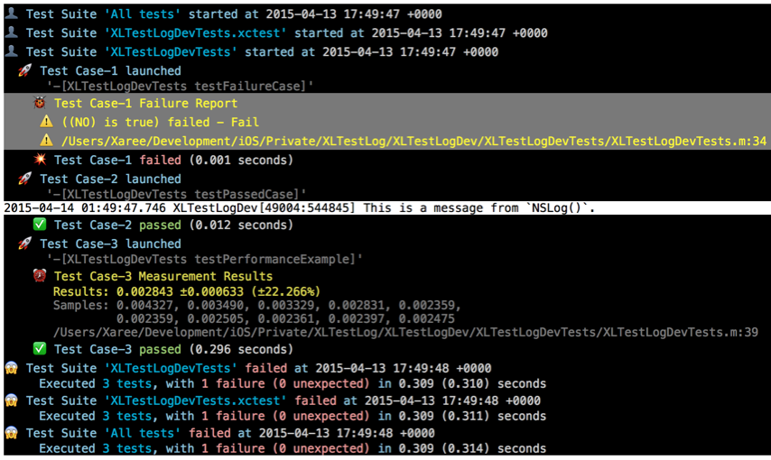
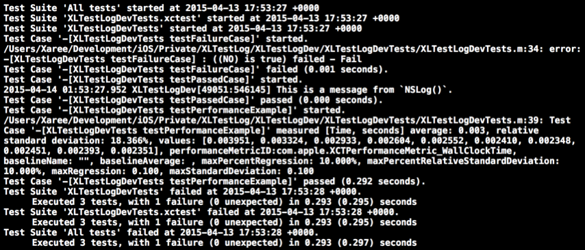

# XLTestLog

**XLTestLog** is a lightweight library for stylish XCTest logs. It makes your testing logs more readable in Xcode Console.

 - Reformat the log messages to make them more readable.
 - Use indentations and Emoji bullets for different logs.
 - Paint log messages and highlight important keywords using [XcodeColors].
 - Only test logs will be styled. You can distinguish colored test logs from other logs (e.g. `NSLog()`).

The following is an example for test results in Xcode Console using XLTestLog:




And this is without using XLTestLog:




The readability between them is quite different. The original test code for the console logs is simple **(one passed test, one failed test, one measure task, and one message from`NSLog()`)**:

```objc
@implementation XLTestLogDevTests

- (void)testPassedCase {
  XCTAssert(YES, @"Pass");
  NSLog(@"This is a message from `NSLog()`.");
}

- (void)testFailureCase {
  XCTAssert(NO, @"Fail");
}

- (void)testPerformanceExample {
  // This is an example of a performance test case.
  [self measureBlock:^{
    int j = 0;
    for (int i = 0; i < 1000000; i++) {
      j += i;
    }
  }];
}
@end
```

## How to use

No additional code is needed to use XLTestLog.

1. Include XLTestLog in your test target (see [Installation section](#installation)).
2. Install [XcodeColors] plugin.
3. Just run your test, and see the delightful logs in the Xcode Console.


## Release Notes

### You should also install XcodeColors

Currently, you should use XLTestLog with [XcodeColors]. If you don't, it would show the color code in the logs.

In the next release, XLTestLog will [read the environment variable `XcodeColors`](https://github.com/robbiehanson/XcodeColors#option-1-manual-use--custom-macros) to decide whether using XcodeColors to paint log messages or not.


## Installation

Before installing XLTestLog, please read the section **Release Notes**.

### via CocoaPods

You can install XLTestLog simply via [CocoaPods]:

```
target :MyAppTests do
  pod 'XLTestLog'
end
```


### Manually

You can install XLTestLog manually via adding files in `XLTestLog/` directory into your project.


## About

### Contribution

Any help would be most welcome. Even buy me a beer. :p


### Author
* Xaree Lee (李岡諭, Kang-Yu Lee), an iOS developer from Taiwan.
    - <xareelee@gmail.com>


### License
XLTestLog is available under the MIT license. See the [LICENSE] file for more info.


[CocoaPods]: https://cocoapods.org
[XcodeColors]: https://github.com/robbiehanson/XcodeColors
[LICENSE]: ./LICENSE.md
